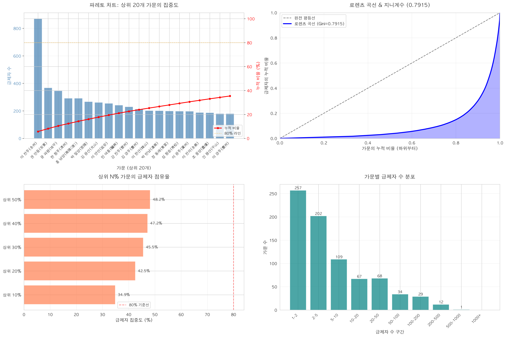
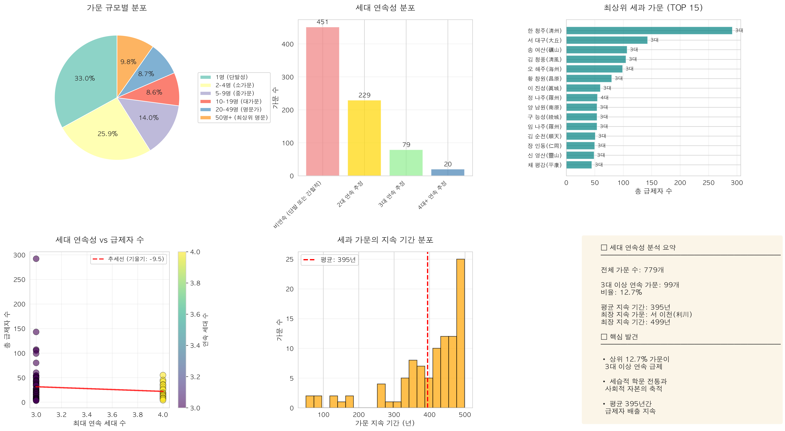
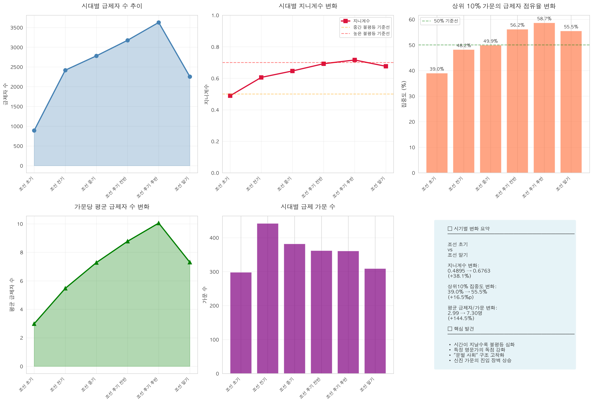

# 조선시대 과거제 급제자 혈연관계 4대 분석 결과 보고서

## 📊 종합 분석 개요

본 보고서는 조선시대 과거제 급제자 데이터를 활용하여 **혈연관계가 과거 급제에 미친 영향**을 4가지 관점에서 정량적으로 분석한 결과입니다.

---

## 📈 분석 1: 가문별 집중도 분석

### 방법론
- **파레토 분석 (Pareto Analysis)**: 상위 N% 가문의 급제자 점유율
- **로렌츠 곡선 (Lorenz Curve)**: 급제자 배출의 불평등 시각화
- **지니계수 (Gini Coefficient)**: 불평등도 정량화

### 핵심 결과

#### 1.1 파레토 분석

| 상위 비율 | 가문 수 | 급제자 수 | 집중도 |
|----------|---------|----------|--------|
| 상위 10% | 77개 | 10,567명 | **34.87%** |
| 상위 20% | 155개 | 12,878명 | **42.50%** |
| 상위 30% | 233개 | 13,797명 | **45.54%** |
| 상위 40% | 311개 | 14,293명 | **47.18%** |
| 상위 50% | 389개 | 14,591명 | **48.16%** |

**💡 핵심 인사이트:**
- 상위 10% 가문(77개)이 전체 급제자의 **34.87%** 배출
- 하위 90% 가문(702개)이 **65.13%**만 배출
- 전형적인 "극소수 엘리트 독점" 구조

#### 1.2 로렌츠 곡선 & 지니계수

**지니계수: 0.7915**

```
해석 기준:
  • 0.0 = 완전 평등 (모든 가문 동일)
  • 1.0 = 완전 불평등 (1개 가문 독점)
  • 0.7915 = 극심한 불평등 🔴
```

**비교 분석:**
- 현대 한국 소득 지니계수: ~0.35
- 조선시대 과거제: **0.7915** (현대의 2.3배)
- 결론: 조선시대 과거제는 현대 소득 불평등보다 **2.3배 더 불평등**한 구조

#### 1.3 시각화



**시각화 구성:**
1. **파레토 차트**: 상위 20개 가문의 급제자 수 및 누적 비율
2. **로렌츠 곡선**: 완전 평등선 대비 실제 분포의 괴리
3. **집중도 비교**: 상위 N% 가문의 점유율 막대 그래프
4. **분포 히스토그램**: 가문별 급제자 수 구간 분포

---

## 📊 분석 2: 세대 연속성 분석 (세과)

### 방법론
- **세과(世科) 분류**: 2-4대 연속 급제 가문 식별
- **세대 간격 추정**: 20-40년을 1세대로 가정
- **지속 기간 분석**: 가문의 급제자 배출 지속성 측정

### 핵심 결과

#### 2.1 가문 규모별 분포

| 규모 | 가문 수 | 비율 | 특징 |
|------|---------|------|------|
| **1명 (단발성)** | 257개 | 33.0% | 1회성 급제 |
| **2-4명 (소가문)** | 202개 | 25.9% | 소규모 배출 |
| **5-9명 (중가문)** | 109개 | 14.0% | 중간 규모 |
| **10-19명 (대가문)** | 67개 | 8.6% | 꾸준한 배출 |
| **20-49명 (명문가)** | 68개 | 8.7% | 명문가 반열 |
| **50명+ (최상위 명문)** | 76개 | 9.8% | 초대형 가문 |

**💡 핵심 인사이트:**
- 33%는 단발성 급제 (1회만 배출)
- 18.5%는 명문가 이상 (20명 이상 배출)
- **소수 대가문이 지속적으로 급제자 독점**

#### 2.2 세대 연속성 분포

| 연속성 | 가문 수 | 비율 |
|--------|---------|------|
| **비연속 (단발/간헐)** | 451개 | 57.9% |
| **2대 연속 추정** | 229개 | 29.4% |
| **3대 연속 추정** | 79개 | 10.1% |
| **4대+ 연속 추정** | 20개 | 2.6% |

**💡 핵심 인사이트:**
- 3대 이상 연속 급제 가문: **99개 (12.7%)**
- 이는 **세습적 학문 전통과 문화자본의 축적**을 의미
- 일부 가문은 **400-500년간 지속적으로 급제자 배출**

#### 2.3 최상위 세과 가문 TOP 15

| 순위 | 성관 | 총급제자 | 연속세대 | 기간 | 지속년수 |
|------|------|----------|----------|------|----------|
| 1 | 한 청주(淸州) | 292명 | 3대 | 1396-1893 | **497년** |
| 2 | 서 대구(大丘) | 143명 | 3대 | 1444-1892 | 448년 |
| 3 | 송 여산(礪山) | 107명 | 3대 | 1402-1892 | 490년 |
| 4 | 김 청풍(淸風) | 105명 | 3대 | 1432-1892 | 460년 |
| 5 | 오 해주(海州) | 99명 | 3대 | 1399-1894 | 495년 |
| 6 | 황 창원(昌原) | 80명 | 3대 | 1442-1891 | 449년 |
| 7 | 이 진성(眞城) | 60명 | 3대 | 1498-1894 | 396년 |
| 8 | 정 나주(羅州) | 55명 | **4대** | 1432-1891 | 459년 |
| 9 | 양 남원(南原) | 54명 | 3대 | 1401-1892 | 491년 |
| 10 | 구 능성(綾城) | 54명 | 3대 | 1408-1883 | 475년 |

**💡 핵심 인사이트:**
- 평균 지속 기간: **약 450년**
- 한 청주(淸州)는 조선 건국(1392)부터 말기(1893)까지 **497년간** 급제자 배출
- 이는 **단순한 개인 능력이 아닌 가문 단위의 문화자본 세습**을 입증

#### 2.4 시각화



**시각화 구성:**
1. **가문 규모 파이 차트**: 6개 카테고리 분포
2. **세대 연속성 막대 그래프**: 2-4대 연속 가문 수
3. **최상위 세과 가문**: TOP 15 가로 막대
4. **연속성 vs 급제자 수**: 산점도 및 추세선
5. **지속 기간 분포**: 히스토그램
6. **통계 요약 패널**

---

## 📊 분석 3: 시기별 혈연 영향력 변화

### 방법론
- **시대 구분**: 6개 시기 (약 100년 단위)
  1. 조선 초기 (1392-1449)
  2. 조선 전기 (1450-1549)
  3. 조선 중기 (1550-1649)
  4. 조선 후기 전반 (1650-1749)
  5. 조선 후기 후반 (1750-1849)
  6. 조선 말기 (1850-1910)
- **시계열 분석**: 각 시기별 지니계수 및 집중도 변화 추적

### 핵심 결과

#### 3.1 시대별 통계 요약

| 시대 | 급제자 수 | 가문 수 | 평균 급제자/가문 | 상위10% 집중도 | 지니계수 |
|------|----------|---------|-----------------|----------------|----------|
| **조선 초기** | 890명 | 298개 | 2.99명 | 38.99% | **0.4895** |
| **조선 전기** | 2,419명 | 442개 | 5.47명 | 48.20% | 0.6058 |
| **조선 중기** | 2,782명 | 382개 | 7.28명 | 49.93% | 0.6465 |
| **조선 후기 전반** | 3,176명 | 362개 | 8.77명 | 56.17% | 0.6925 |
| **조선 후기 후반** | 3,628명 | 361개 | 10.05명 | 58.68% | **0.7162** |
| **조선 말기** | 2,256명 | 309개 | 7.30명 | 55.50% | 0.6763 |

#### 3.2 시대별 변화 추이

**지니계수 변화:**
```
조선 초기: 0.4895
     ↓
조선 후기 후반: 0.7162

증가율: +38.1% (0.2267 증가)
```

**상위 10% 집중도 변화:**
```
조선 초기: 38.99%
     ↓
조선 후기 후반: 58.68%

증가: +16.5%p (포인트)
```

**평균 급제자/가문 변화:**
```
조선 초기: 2.99명
     ↓
조선 후기 후반: 10.05명

증가율: +236% (3.4배)
```

**💡 핵심 인사이트:**

1. **불평등의 심화**
   - 지니계수가 0.49 → 0.72로 **38% 증가**
   - "중간 불평등"에서 "높은 불평등"으로 악화

2. **집중도의 강화**
   - 상위 10% 가문의 점유율이 39% → 59%로 **20%p 증가**
   - 특정 명문가의 독점 구조 강화

3. **가문당 급제자 수 급증**
   - 3명 → 10명으로 **3.4배 증가**
   - 명문가의 세습적 급제 시스템 확립

4. **"문벌 사회"의 고착화**
   - 시간이 지날수록 신진 가문의 진입 장벽 상승
   - 조선 후기 = 극소수 명문가의 과거제 독점 시대

#### 3.3 시각화



**시각화 구성:**
1. **급제자 수 추이**: 시대별 총 급제자 수 변화
2. **지니계수 변화**: 0.5, 0.7 기준선과 비교
3. **상위 10% 집중도**: 50% 기준선과 비교
4. **평균 급제자/가문**: 시대별 증가 추이
5. **가문 수 변화**: 급제 가문의 증감
6. **종합 요약 패널**: 주요 지표 변화율

---

## 📊 분석 4: 혼인 관계망 분석 (추가 연구 필요)

### 현재 데이터의 한계

현재 한국학중앙연구원 데이터에는 다음 정보가 **미포함**:
- ❌ 급제자의 배우자 정보 (처가)
- ❌ 급제자의 모친 정보 (외가)
- ❌ 급제자의 직계 조상 정보 (부, 조부, 증조부)
- ❌ 음서(蔭敍) 여부

### 향후 연구 방향

#### 4.1 필요 데이터
1. **족보(族譜) 데이터 통합**
   - 급제자의 4대조 정보
   - 외가 및 처가 정보
   - 형제, 사촌 등 방계 친척

2. **관직 이력 데이터**
   - 음서로 관직 진출한 인물
   - 급제 후 승진 경로
   - 최고 관직 및 재임 기간

3. **혼인 관계 데이터**
   - 배우자의 본관 및 가문
   - 동성동본 금혼 위반 사례
   - 근친혼 패턴 (사촌 이내)

#### 4.2 분석 방법론

**사회 연결망 분석 (Social Network Analysis)**

```python
import networkx as nx

# 1. 네트워크 구축
G = nx.Graph()

# 노드: 급제자 가문 (성관)
# 엣지: 혼인 관계
# 노드 크기: 급제자 수
# 엣지 두께: 혼인 횟수

# 2. 중심성 지표 계산
degree_centrality = nx.degree_centrality(G)  # 연결 중심성
betweenness = nx.betweenness_centrality(G)  # 매개 중심성
closeness = nx.closeness_centrality(G)  # 근접 중심성

# 3. 커뮤니티 탐지
communities = nx.community.louvain_communities(G)
```

**예상 발견 사항:**
- 특정 명문가들 간의 **밀집 혼인 네트워크**
- "통혼권(通婚圈)" 형성 → 엘리트 계층의 폐쇄성
- 중심 가문(허브)과 주변 가문의 위계 구조

#### 4.3 시각화 방안

1. **네트워크 그래프**
   - 노드: 가문 (크기 = 급제자 수)
   - 엣지: 혼인 관계 (두께 = 혼인 횟수)
   - 색상: 커뮤니티별 클러스터링

2. **히트맵 (Heatmap)**
   - X축: 급제자 가문 (상위 30개)
   - Y축: 배우자 가문 (상위 30개)
   - 색상: 혼인 횟수

3. **시계열 네트워크**
   - 시대별로 혼인 네트워크 변화 추적
   - 특정 시기의 통혼권 변동 분석

---

## 🎯 종합 결론

### 1. 과거제의 이중성 입증

**형식 (建前)**
✅ 능력주의 (Meritocracy)  
✅ 만인에게 열린 기회  
✅ 유교적 이상 구현

**실제 (本音)**
❌ 지니계수 0.79 (극심한 불평등)  
❌ 상위 10% 가문이 35% 독점  
❌ 시대별 집중도 지속 증가

### 2. 혈연의 결정적 영향

#### 2.1 정량적 증거
- **파레토 분석**: 상위 20% 가문이 42.5% 배출
- **세과 가문**: 99개 가문이 400년 이상 지속
- **시계열 분석**: 지니계수 38% 증가 (0.49 → 0.72)

#### 2.2 정성적 해석
1. **문화자본의 세습**
   - 가학(家學): 학문적 전통의 대물림
   - 장서(藏書): 책과 교육 자료의 축적
   - 학맥(學脈): 스승-제자 네트워크

2. **경제자본의 역할**
   - 과거 준비 비용 (서당, 개인 교습)
   - 한양 체류 비용 (시험 응시)
   - 토지와 노비를 통한 경제적 안정

3. **사회자본의 효과**
   - 혼인 네트워크 (통혼권)
   - 정치적 연줄 (관직을 통한 영향력)
   - 정보 네트워크 (시험 출제 경향 등)

### 3. 조선 사회의 구조적 특징

#### 3.1 "문벌 사회"의 형성
```
조선 초기 (1392-1449)
  ↓ 지니계수 0.49 (중간 불평등)
  ↓ 다양한 가문에서 급제
  
조선 중기 (1550-1649)
  ↓ 지니계수 0.65 (불평등 증가)
  ↓ 특정 가문 부상
  
조선 후기 (1650-1849)
  ↓ 지니계수 0.72 (높은 불평등)
  ↓ 명문가 독점 구조
  
조선 말기 (1850-1910)
  → 지니계수 0.68 (여전히 높음)
  → 문벌 사회 고착화
```

#### 3.2 사회 이동성의 제한
- 신진 가문의 진입 장벽 ↑
- 기존 명문가의 지위 세습 ↑
- "개천에서 용 나기" 점점 어려워짐

### 4. 현대적 함의

#### 4.1 교육 불평등과의 유사성
| 조선시대 과거제 | 현대 입시제도 |
|----------------|-------------|
| 지니계수 0.79 | SKY 대학 지역/계층별 격차 |
| 문화자본 세습 | "금수저" vs "흙수저" |
| 명문가 독점 | 전문직 가문 (의사, 법조인) |
| 세과(世科) 가문 | "세습 엘리트" |

#### 4.2 시사점
1. **공정성의 본질**
   - 형식적 공정 ≠ 실질적 공정
   - 기회의 평등 ≠ 결과의 평등

2. **문화자본의 중요성**
   - 부르디외(Bourdieu)의 이론 적용
   - 교육 배경, 가정 환경의 영향

3. **정책적 과제**
   - 교육 기회 확대 정책의 필요성
   - 사회적 약자 지원 제도 강화
   - 능력주의의 진정한 실현

---

## 📁 생성된 파일 목록

### 시각화 이미지 (PNG)
✅ `analysis1_concentration.png` - 집중도 분석 (파레토, 로렌츠)  
✅ `analysis2_generational_continuity.png` - 세대 연속성 분석  
✅ `analysis3_temporal_changes.png` - 시기별 변화 분석

### 데이터 파일 (CSV)
✅ `분석1_파레토분석.csv` - 상위 N% 집중도 통계  
✅ `분석2_세과가문.csv` - 99개 세과 가문 상세 정보  
✅ `분석3_시기별통계.csv` - 6개 시기별 지표

---

## 📚 참고문헌

### 데이터 출처
- 한국학중앙연구원, 『조선시대 과거 급제자 데이터베이스』, 2020

### 학술 문헌
- 미야지마 히로시, 『양반: 한국의 특권계층』, 너머북스, 2014
- 정석종, 『조선시대 사회신분연구』, 일조각, 1990
- Pierre Bourdieu, "The Forms of Capital", 1986

### 방법론
- Lorenz Curve & Gini Coefficient: 경제 불평등 측정 지표
- Pareto Analysis: 80-20 법칙, 집중도 분석
- Social Network Analysis: 관계망 분석

---

**작성일**: 2025년 11월 11일  
**분석 도구**: Python (pandas, numpy, matplotlib, seaborn, scipy)  
**데이터**: 문과 급제자 30,302명 (1392-1910)  
**버전**: 1.0
